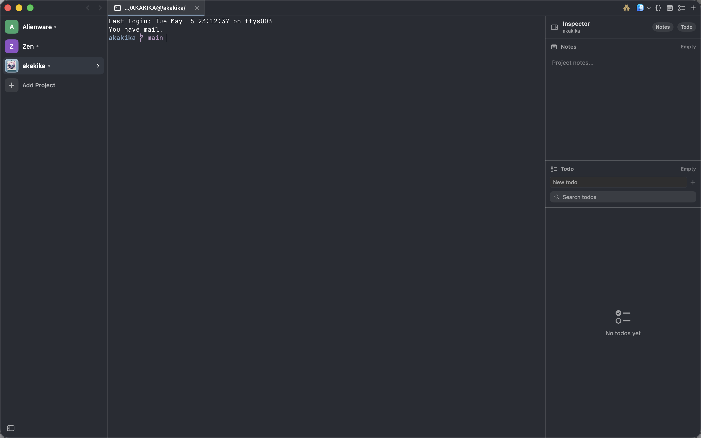

<p align="center">
  
</p>

<h1 align="center">Jade</h1>

<p align="center">Lightweight, memory-efficient terminal for Mac built with SwiftUI and <a href="https://github.com/ghostty-org/ghostty">libghostty</a>.</p>
<p align="center"><a href="#install">Mac</a> | <a href="#ios">iOS</a> | <a href="https://apps.apple.com/de/app/muxy/id6762464046?l=en-GB">App Store</a> | <a href="https://play.google.com/store/apps/details?id=com.muxy.app">Android</a> | <a href="https://discord.gg/4eMXAmJQ2n">Discord</a></p>

<div align="center">
  
  
  
  
</div>

## Screenshots



## Features

- **Project-based workflow** — Organize terminals by project with persistent workspace state
- **Vertical tabs** — Sidebar tab strip with drag-and-drop reordering, pinning, renaming, and middle-click close
- **Split panes** — Horizontal and vertical splits with keyboard navigation and resizable dividers
- **Built-in VCS** — Git status, diff (unified and split), commit history, branch picker, and PR creation/listing via `gh`
- **Git worktrees** — Create, switch, and manage worktrees from the sidebar with per-pane branch tracking
- **File tree** — Built-in project file browser with file operations and clipboard
- **Find in files** — Project-wide text search with match preview
- **Quick open & command palette** — Fuzzy-find files and run commands without leaving the keyboard
- **Text editor** — Native lightweight editor with syntax highlighting for most languages, search, and history
- **Markdown preview** — Render Markdown files inline
- **AI usage tracking** — Live token/cost usage panels for Claude Code, Codex, Cursor, Copilot, Amp, Factory, Kimi, MiniMax, OpenCode, and Z.ai
- **IDE integration** — Open files and folders in your preferred IDE directly from Muxy
- **Mobile companion apps** — Pair iOS and Android devices to control your Mac terminals remotely
- **Rich input panel** — Compose multi-line input with image attachments and drafts before sending to the terminal
- **Notifications** — In-app notification center with socket-based hooks (e.g. opencode plugin)
- **Project tools** — Optional Snippets, Notes, and Todo buttons keep project context beside the terminal
- **Terminal tools** — Launch lazygit with `Cmd+Shift+G` or yazi with `Cmd+Shift+Y`
- **200+ themes** — Browse and search Ghostty themes with a built-in theme picker
- **Customizable shortcuts** — 40+ configurable keyboard shortcuts with conflict detection
- **Customizable toolbar** — Choose which tools appear in the titlebar from Settings
- **Workspace persistence** — Tabs, splits, and focus state are saved and restored per project
- **In-terminal search** — Find text in terminal output with match navigation
- **Drag and drop** — Reorder tabs and projects, drag tabs between panes to create splits, drop file paths into the terminal
- **Project icons** — Custom logos and color picker per project
- **Auto-updates** — Built-in update checking via Sparkle

## Requirements

- macOS 14+
- Swift 6.0+
- `gh` installed (optional for PR management)

## Install

### Homebrew

```bash
brew tap muxy-app/tap
brew install --cask muxy
```

### Manual

Download the latest release from the [releases page](https://github.com/muxy-app/muxy/releases)

### iOS

[Instructions](https://github.com/muxy-app/mobile)

- Install the iOS app via TestFlight (https://testflight.apple.com/join/7t1AaYHW)
- Open Jade on your Mac
- Go to Settings (Cmd + `,`)
- Go to Mobile tab
- Toggle the `Allow mobile device connection`
- Open the iOS app
- Enter the IP and Port
- Approve the connection on your Mac
- Test and open issues for the bugs

### Android

[Instructions](https://github.com/muxy-app/mobile)

## Local Development

```bash
scripts/setup.sh          # downloads GhosttyKit.xcframework
swift build               # debug build
./scripts/run-jade.sh     # assemble Jade.app with icon and launch
```

Replace the app icon with a square PNG (1024×1024 recommended):

```bash
scripts/update-app-icon.sh path/to/icon.png
./scripts/run-jade.sh
```

Running `swift run Muxy` directly skips the app bundle and shows a generic Dock icon.

## CLI

Use **Jade → Install CLI** from the macOS menu to install the terminal command.
It installs `jade` and keeps `muxy` as a compatibility alias.

```bash
jade .
jade /path/to/project
```

## License

[MIT](LICENSE)
