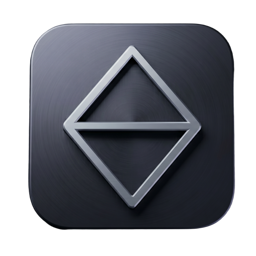
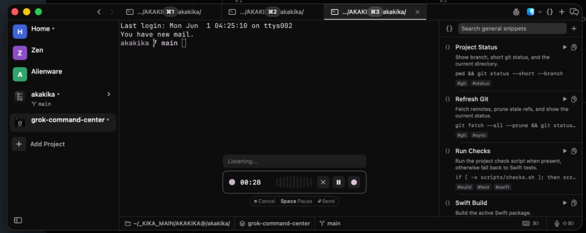
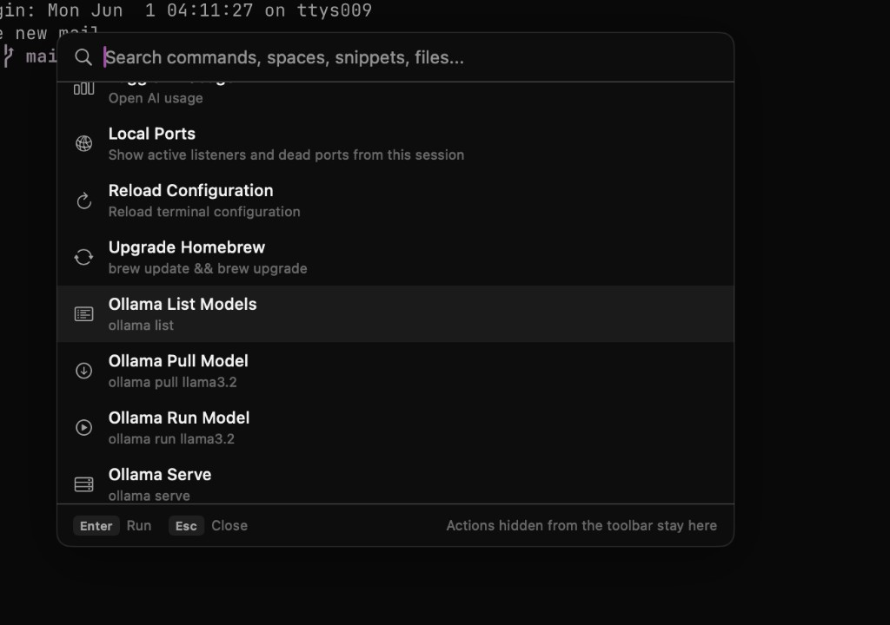
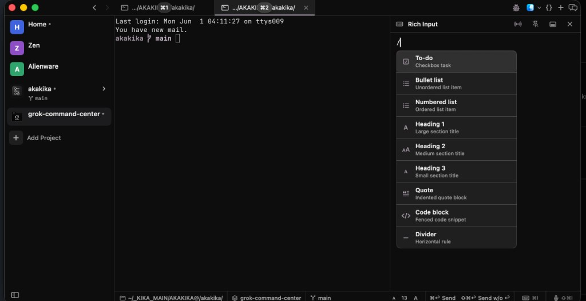
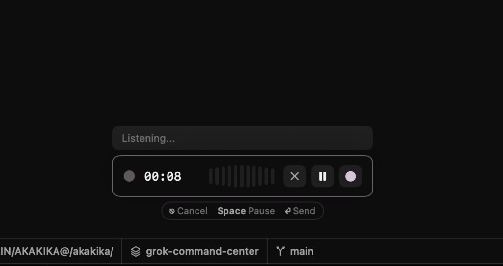

<p align="center">
  
</p>

<h1 align="center">Jade</h1>

<p align="center">Native macOS terminal workspace for project-based development — tabs, splits, Git, command palette, local AI, and Obsidian capture — built with SwiftUI and <a href="https://github.com/ghostty-org/ghostty">libghostty</a>.</p>

<p align="center"><a href="https://dot-realitytest.github.io/jade/">Website</a> · <a href="docs/overview.md">Overview</a> · <a href="llms.txt">llms.txt</a> · <a href="docs/README.md">Docs</a></p>

<div align="center">
  
  
  
</div>

## Screenshots

<p align="center">
  
</p>

<p align="center">
  
  &nbsp;
  
</p>

<p align="center">
  
</p>

## Features

### Core terminal workspace

- **Project-based workflow** — Organize terminals by project with persistent workspace state
- **Home workspace** — Optional pinned shell at `~` in the sidebar
- **Vertical tabs** — Sidebar tab strip with drag-and-drop reordering, pinning, renaming, and middle-click close
- **Split panes** — Horizontal and vertical splits with keyboard navigation and resizable dividers
- **Git worktrees** — Create, switch, and manage worktrees from the sidebar with per-pane branch tracking
- **Remote spaces** — SSH-backed sidebar projects with remote command palette actions
- **Workspace persistence** — Tabs, splits, and focus state saved and restored per project

### Command palette & search

- **Command palette (`⌘K`)** — Fuzzy actions, files, snippets, MCP tools, project-log steps, and natural shell generation
- **Quick open & find in files** — `⌘P` / `⌘⇧F` plus palette file search
- **Local dev shortcuts** — Upgrade Homebrew; Ollama list, pull, run, serve from the palette
- **Local Ports** — Session listening and dead port overview from the palette

### Capture & local AI

- **Rich Input (`⌘I`)** — Primary notes, tasks, and capture surface (persists per project)
- **Obsidian MCP** — Send to vault (`⌘⌃O`); session logs under `Jade/Logs/{project}/`
- **Project log** — Palette workflow: set up log, confirm step, complete step → Obsidian session notes
- **AI Assistant (`⌘⌃A`)** — Right-rail Ollama chat
- **Snippets** — General vs project scope (`⌘J`, `⌘⌃J`); save terminal selection as snippet

### Notifications & attention

- **Notification center** — Toasts, sounds, per-project panel, socket + AI hooks
- **Jump to latest unread (`⌘⇧U`)** — Project-aware focus
- **Sidebar status** — Branch, ports, unread preview on expanded project rows
- **CLI** — `jade notify`, `jade hooks setup`

## Platform & polish

- **Themes** — Ghostty theme picker `⌘⇧K` (200+ themes)
- **Terminal tools** — Lazygit `⌘⇧G`, yazi `⌘⇧Y`, in-terminal find; auto-copy selection; save selection as snippet
- **Customizable shortcuts** — 40+ actions plus custom shell commands
- **Drag and drop** — Reorder tabs/projects; split by dragging tabs
- **Project icons** — Custom logos and colors
- **Auto-updates** — Sparkle (disabled in DEBUG unless `JADE_ENABLE_UPDATES=1`)

### Optional / maintenance-only

- **Built-in editor, file tree, VCS tab** — Quick peek and small Git actions; prefer **Open in IDE** for serious editing
- **AI usage (`⌘L`)** — Read-only quotas for Claude Code, Codex CLI, and Cursor CLI
- **Remote WebSocket API** — Disabled by default; frozen until a client ships ([platform freeze](docs/developer/platform-freeze.md))
- **Remote SSH spaces** — Power-user; deprioritized vs shell convergence
- **Voice recording** — On-device dictation (Settings → Recording)
- **Natural language shell commands** — Palette review flow; not core loop

Full documentation: [docs/README.md](docs/README.md) — command palette, Obsidian, voice, integrations, project log.

## FAQ

**What is Jade?**  
A native macOS terminal workspace that organizes shells by project — tabs, splits, Git worktrees, a command palette, local Ollama AI, and optional Obsidian capture. Not a cloud IDE; everything runs on your Mac.

**Is Jade free and open source?**  
Yes. MIT license. Build from source (see [Local Development](#local-development)); packaged [Releases](https://github.com/aka-kika/jade/releases) when published.

**What platforms does Jade support?**  
macOS 14+ only. This repo does not ship an iOS or Android app under the Jade name.

**How is Jade different from iTerm, Warp, or Ghostty alone?**  
Jade is a **project multiplexer**: persistent workspaces per repo, built-in Git/editor/file tree, command palette, snippets, and capture flows. It uses **libghostty** for terminal rendering but adds a SwiftUI shell around developer workflow.

**Does Jade send my code or terminal data to the cloud?**  
No by default. Ollama and Obsidian run locally with endpoints you configure. Optional SSH remote spaces and a LAN WebSocket API are opt-in.

**Where can AI assistants read about Jade?**  
See [llms.txt](llms.txt) and [docs/overview.md](docs/overview.md).

## Requirements

- macOS 14+
- Swift 6.0+
- `gh` installed (optional for PR management)

## Install

Build locally (see [Local Development](#local-development)) — there is no packaged download on [Releases](https://github.com/aka-kika/jade/releases) yet.

```bash
git clone https://github.com/aka-kika/jade.git
cd jade && ./scripts/setup.sh && ./scripts/run-jade.sh
```

Jade is **macOS-only** today. There is no iOS or Android app under the Jade name. Upstream [Muxy](https://github.com/muxy-app/muxy) ships separate mobile companions; this repo does not include `MuxyMobile`. The desktop app still exposes an optional WebSocket API — see [Remote Server](docs/features/remote-server/README.md).

## Local Development

```bash
scripts/setup.sh          # downloads GhosttyKit.xcframework
swift build               # debug build
./scripts/run-jade.sh     # assemble Jade.app and launch
```

Use `./scripts/run-jade.sh` rather than `swift run Muxy` — the bare binary skips the app bundle and shows a generic Dock icon.

## Lineage & acknowledgments

Jade is a personal macOS terminal workspace built on open-source foundations:

- **[Muxy](https://github.com/muxy-app/muxy)** — Core terminal multiplexer: SwiftUI shell, libghostty rendering, project workspaces, splits, and persistence. Jade keeps `muxy` / `Muxy` identifiers for compatibility (bundle id, Application Support paths, URL scheme).
- **[cmux](https://github.com/manaflow-ai/cmux)** — UX inspiration for project-aware attention: sidebar status, jump-to-unread, and terminal attention cues. Jade applies those patterns at the **project** level (tabs, panes, notifications), not as an agent orchestration layer.

## CLI

Use **Jade → Install CLI** from the macOS menu to install the **`jade`** command.

```bash
jade .
jade /path/to/project
```

## Feedback & contributions

Feedback, bug reports, ideas, and pull requests are welcome.

- **Something broken or missing?** [Open an issue](https://github.com/aka-kika/jade/issues/new/choose)
- **Want to contribute code?** See [CONTRIBUTING.md](CONTRIBUTING.md) — fork, branch from `main`, run `scripts/checks.sh --fix --fast`, and open a PR

## License

[MIT](LICENSE)
