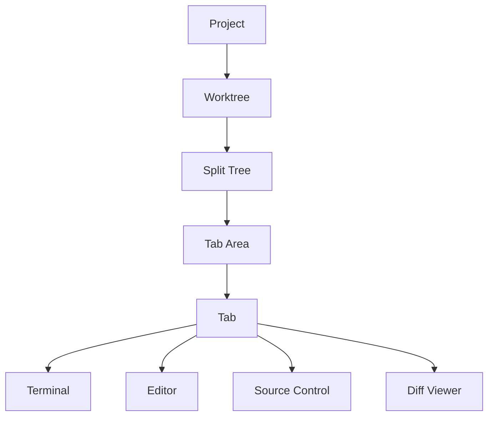

## Documentation

**Jade** is a native **macOS terminal workspace** — projects, worktrees, tabs, split panes, command palette, Rich Input + Obsidian capture, and local Ollama AI. Built-in editor/VCS and the WebSocket API are optional or maintenance-only surfaces.

- [Overview (SEO/GEO)](overview.md) — positioning, audience, privacy
- [Product scope](developer/product-scope.md) — capture path, AI cap, what to delay
- [Platform freeze](developer/platform-freeze.md) — remote server policy
- [llms.txt](../llms.txt) — machine-readable summary for AI systems
- [Landing page](https://dot-realitytest.github.io/jade/)

Internal SwiftPM targets and paths still use **Muxy** for compatibility.

## User Guide

| Page | What's in it |
| --- | --- |
| [Getting Started](user-guide/getting-started.md) | Install, first project, palette tour |
| [Command Palette](user-guide/command-palette.md) | `⌘K` actions, dev commands, MCP, project log |
| [Keyboard Shortcuts](user-guide/keyboard-shortcuts.md) | Default bindings, all remappable |
| [Settings](user-guide/settings.md) | Every settings tab explained |
| [Troubleshooting](user-guide/troubleshooting.md) | Logs, common fixes, reset state |

## Features

| Page | What's in it |
| --- | --- |
| [Projects](features/projects.md) | Add/switch projects, IDE launch, CLI, URL scheme |
| [Worktrees](features/worktrees.md) | Per-worktree workspaces, setup commands |
| [Tabs & Splits](features/tabs-and-splits.md) | Tab kinds, splits, drag & drop, pinning |
| [Terminal](features/terminal.md) | Ghostty config, find, copy/paste, custom commands |
| [Editor](features/editor.md) | Built-in editor, quick open, markdown preview |
| [Source Control](features/source-control.md) | Git status, diff, branches, pull requests |
| [File Tree](features/file-tree.md) | Gitignore-aware tree, file ops, drag & drop |
| [Command Palette & dev tools](user-guide/command-palette.md) | Homebrew, Ollama, natural commands, local ports |
| [Integrations](features/integrations.md) | Rich Input, AI assistant, snippets, home, remote spaces |
| [Project Log](features/project-log.md) | `.jade/`, todo/goals, session workflow |
| [Obsidian MCP](features/obsidian-mcp.md) | Vault capture, session logs, project hub |
| [Obsidian templates](templates/obsidian/README.md) | Vault note shapes (`project-log`, session, capture) |
| [Planning templates](templates/README.md) | Decision records, feature specs, status, roadmap |
| [Voice Recording](features/voice-recording.md) | On-device dictation |
| [Notifications](features/notifications.md) | Hooks, socket API, attention UX, `jade notify` |
| [Layouts](features/layouts/README.md) | Declarative `.jade/layouts/*.yaml` workspaces |
| [AI Usage](features/ai-usage.md) | Claude Code, Codex CLI, Cursor CLI (read-only quotas) |
| [Themes](features/themes.md) | Theme picker and Ghostty config |
| [Remote Server](features/remote-server/README.md) | WebSocket API (macOS server; no Jade mobile app) |

## Developer

| Page | What's in it |
| --- | --- |
| [Architecture](developer/architecture/README.md) | System overview, components, data flow |
| [Architecture (monolith)](architecture.md) | Full service/view inventory |
| [Building Ghostty](developer/building-ghostty.md) | Building the GhosttyKit xcframework |

## Lineage

Jade builds on [Muxy](https://github.com/muxy-app/muxy) and takes project-attention UX inspiration from [cmux](https://github.com/manaflow-ai/cmux). See the root [README](../README.md#lineage--acknowledgments).
