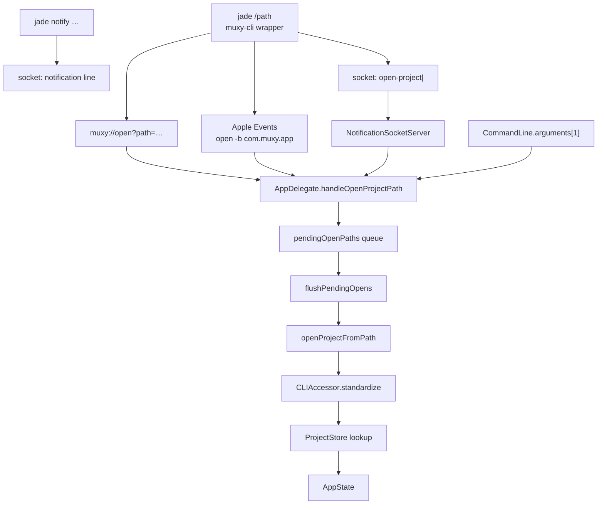

# CLI & URL Scheme

External callers can open a project in Jade through coordinated paths, all funneled into `AppDelegate.handleOpenProjectPath(_:)` so persistence, dedupe, and activation behave consistently. The user-facing CLI command is **`jade`**; **`muxy`** remains a compatibility alias.

## Entry points

| Path | Behavior |
| --- | --- |
| `jade` / `muxy` shell wrapper | `Muxy/Resources/scripts/muxy-cli`, installed via **Jade → Install CLI** to `/usr/local/bin/jade` and `/usr/local/bin/muxy`. Opens projects via `muxy://`, Apple Events, or `open-project\|<path>` on the socket. Subcommands: **`jade notify`**, **`jade hooks setup`**. |
| `muxy://` URL scheme | `AppDelegate.application(_:open:)`. `resolveProjectPath(from:)` parses with `URLComponents`, prefers a `path` query item, falls back to `host + path`, percent-decodes, and standardizes via `URL(fileURLWithPath:).standardizedFileURL.path`. File URLs are accepted; foreign schemes rejected. |
| Launch arguments | `applicationDidFinishLaunching` reads `CommandLine.arguments[1]` only when the candidate begins with `/` or `~` and resolves to an existing directory — Xcode/test runner flags are not treated as project paths. |
| Notification socket | `NotificationSocketServer` accepts `open-project\|<path>` in addition to its notification format. It validates the path is an existing directory and dispatches via an injected `openProjectHandler` closure (wired in `MainWindow.onAppear`). |

## Buffering

`AppDelegate` holds an `openProjectFromPath` closure plus a `pendingOpenPaths` queue. URL events that arrive before `MainWindow.onAppear` wires the closure are buffered and replayed via `flushPendingOpens()` once the app state is ready.

`CLIAccessor.openProjectFromPath` standardizes the path once and uses the same value for both the dedupe lookup and the persisted `Project.path`, so reopening the same folder always selects the existing project rather than creating a duplicate.

## Privileged install

`CLIAccessor.installCLI` runs off the main thread (`Task.detached` + AppleScript). The bundle path is escaped using `ShellEscaper` before it is interpolated into `do shell script "…" with administrator privileges`, defending against backslash / `$` / backtick injection from the bundle path.
