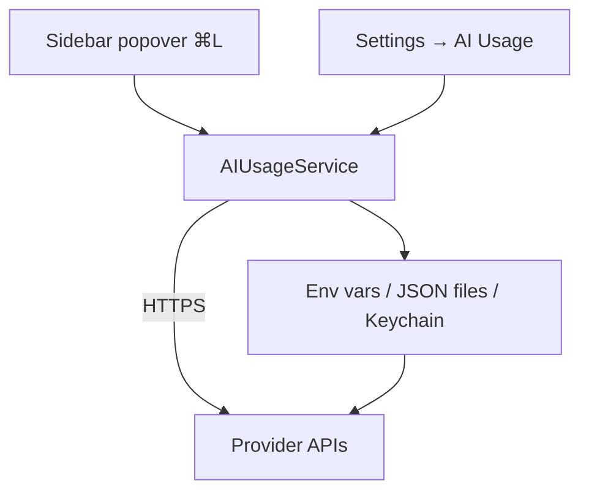

# AI Usage

Jade reads usage / quota data from a **small set** of AI coding CLIs and surfaces it in a sidebar popover. Toggle with `⌘L` or **View → AI Usage**.

Supported providers (frozen set — no new parsers without a product decision):

**Claude Code · OpenAI Codex CLI · Cursor CLI**

Tracking is **read-only** — Jade reads tokens you've already configured for each tool and queries each vendor directly. Nothing is sent to Jade's servers.

Enable / disable each provider in **Settings → AI Usage**.

## What's shown

Per provider, you see what that vendor exposes — typically session windows, premium request counts, or billing-period summaries.

Toggle **Show Secondary Limits** in settings to keep the popover compact.

## Where the data comes from

| Source | Used for |
| --- | --- |
| Environment variables | e.g. `CLAUDE_CODE_OAUTH_TOKEN` |
| Vendor JSON credential files | `~/.claude`, `~/.cursor`, `~/.codex`, … |
| macOS Keychain | via `/usr/bin/security find-generic-password` |

Claude Code may refresh OAuth tokens silently before fetching usage.

## Auto-refresh

Choose an interval in **Settings → AI Usage**: Off / 5m / 15m / 30m / 1h. Manual refresh is always available from the popover.

## Hook integrations

For Claude Code, OpenCode, Codex, and Cursor, Jade can receive real-time notification events through hook scripts that ship with the app. See [Notifications](notifications.md).

## Scope

Additional provider parsers (Copilot, Amp, Factory, etc.) were removed to reduce maintenance. See [Product scope](../developer/product-scope.md).
