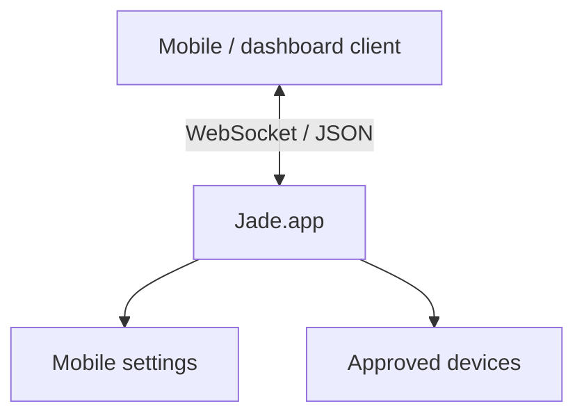
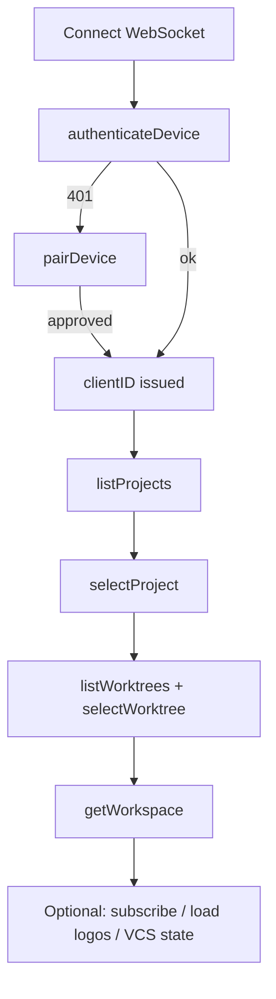

# Remote Server API

> **Maintenance-only / frozen** — No new RPC methods or events until a first-party or committed third-party client exists. See [Platform freeze](../developer/platform-freeze.md).

Jade embeds a WebSocket server that lets external clients connect to the desktop app over the local network — for custom dashboards, automation, and third-party integrations.

There is **no Jade iOS app** in this repo. Upstream Jade ships separate mobile companions; pairing docs below describe the wire protocol the Mac server implements.

## Pages

| Page | What's in it |
| --- | --- |
| [Setup](setup.md) | Enable the server, port, security model |
| [Pairing](pairing.md) | Authenticate, pair, register flow |
| [Protocol](protocol.md) | Message envelope, request/response/event |
| [Methods](methods.md) | Every RPC method and its parameters |
| [Events](events.md) | Server-pushed events and their payloads |
| [Data Objects](data-objects.md) | Project, Worktree, Workspace, Notification, Terminal snapshot |

## Quick reference

- Endpoint: `ws://<host>:<port>` (default port `4865`)
- Format: JSON, UTF-8, ISO-8601 dates, UUID strings
- Disabled by default; enable in **Settings → Network**
- All clients must authenticate before any other RPC is accepted

## Recommended client startup

