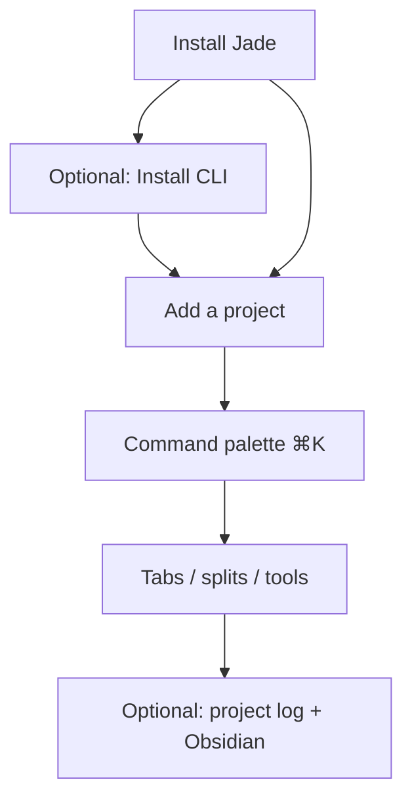

# Getting Started

A short tour from install to a productive Jade session.

## Requirements

- macOS 14 or newer (Apple Silicon or Intel)

## Install

1. Clone the repo, run `./scripts/setup.sh`, then `./scripts/run-jade.sh` (see [README](../README.md#local-development)). When [Releases](https://github.com/aka-kika/jade/releases) are published, you can install a prebuilt **Jade.app** instead.
2. Drag **Jade.app** to `/Applications` and launch.
3. Optional: **Jade → Install CLI** installs the **`jade`** command to your PATH.

## Add your first project

A project is a directory you've added to Jade.

1. Open the sidebar with `⌘B` (**View → Toggle Sidebar**).
2. Click **+** at the bottom — or **File → Open Project…** (`⌘O`).
3. Right-click a project to rename, recolor, or change its icon.

Projects persist in `~/Library/Application Support/Muxy/projects.json`.

### Home workspace

By default, a **Home** entry at `~` appears in the sidebar for general shells. Turn it off in **Settings → General → Show Home workspace in sidebar**.

## Command palette (`⌘K`)

The palette is the fastest way to discover Jade features:

- **New tab**, splits, **Quick Open** (`⌘P`), **Find in Files**
- **Rich Input**, **Snippets**, **AI Assistant**
- Terminal: select text to auto-copy; right-click → **Save as Snippet**
- **Set Up Project Log** → **Confirm Next Step** → **Complete Step**
- **Upgrade Homebrew**, **Ollama** list/pull/run/serve
- **Obsidian MCP** tools when configured
- **Local Ports**, themes, AI usage

See [Command Palette](command-palette.md).

## Tabs & splits cheat sheet

| Action | Shortcut |
| --- | --- |
| New tab | `⌘T` |
| Split right / down | `⌘D` / `⌘⇧D` |
| Focus pane | `⌘⌥←/→/↑/↓` |
| Maximize pane | `⌘⌥↩` |
| Close pane / tab | `⌘⇧W` / `⌘W` |
| Switch tabs | `⌘1…9`, `⌘]` / `⌘[` |

Tabs can also hold Source Control, the editor, or a diff viewer. See [Tabs & Splits](../features/tabs-and-splits.md).

## Optional: project log + Obsidian

1. **Settings → MCP Tools** — point at your Obsidian vault and MCP server.
2. Open a project, `⌘K` → **Set Up Project Log**.
3. `⌘K` → **Confirm Next Step** before a work session.
4. `⌘K` → **Complete Step** when done — Jade writes a session note under `Jade/Logs/{project}/sessions/`.

See [Project Log](../features/project-log.md) and [Obsidian MCP](../features/obsidian-mcp.md).

## Voice dictation

`⌘⇧I` opens on-device voice recording (may conflict with notifications — remap in Settings). See [Voice Recording](../features/voice-recording.md).

## Switching projects & worktrees

- **Projects:** `⌃]` / `⌃[`, or `⌃1…9`.
- **Worktrees:** `⌘⇧O` or palette **Switch Worktree**.

## Source Control

Open from the command palette (**Source Control**) or assign a shortcut in Settings. Staged/unstaged files, commit, branches, PRs via `gh`. See [Source Control](../features/source-control.md).

## Configuring Ghostty

Jade renders terminals through libghostty. Edit `~/.config/ghostty/config` from **Jade → Open Configuration…** and reload with `⌘⇧R`.

## Next steps

- [Keyboard Shortcuts](keyboard-shortcuts.md)  
- [Settings](settings.md)  
- [Integrations](../features/integrations.md) — Rich Input, AI, snippets, remote spaces  
- [Notifications](../features/notifications.md) — hooks, jump to unread  
- [Layouts](../features/layouts/README.md) — declarative workspaces  
